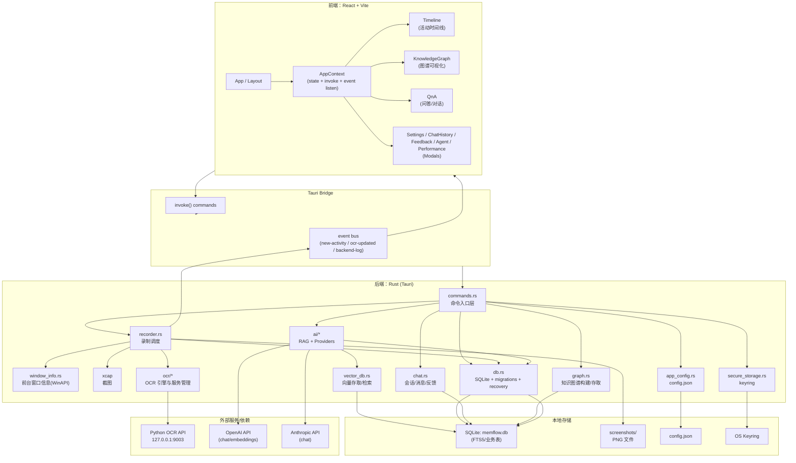
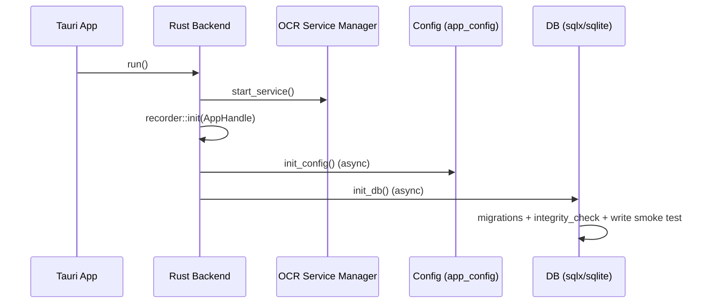
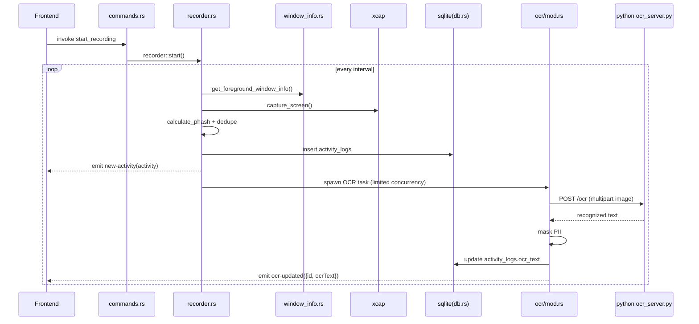
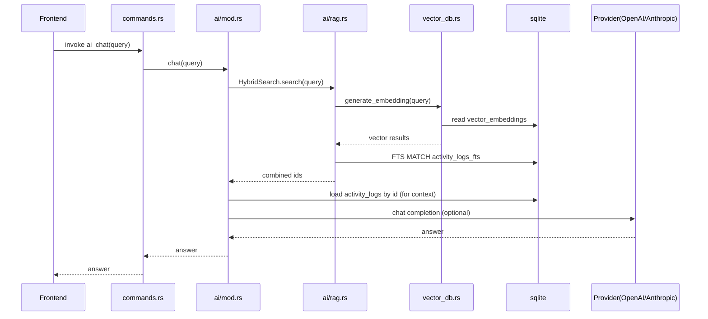
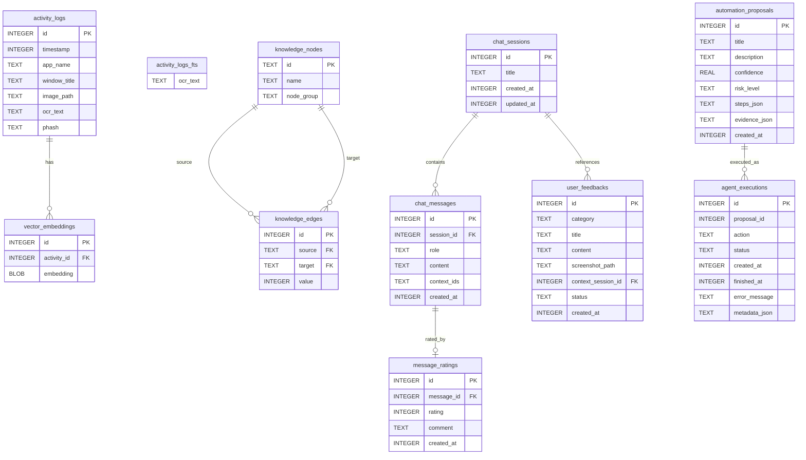

# MemFlow 架构文档

## 1. 概述

MemFlow 是一个基于 Tauri 的桌面应用，目标是自动记录用户的桌面活动（前台窗口信息 + 截图），对截图进行 OCR 文本提取并落库，通过全文检索（FTS5）与向量检索的混合检索能力提供“回忆/问答/分析”，并支持知识图谱可视化、对话历史与反馈，以及一个低风险的自动化 Agent（MVP）。

本文档覆盖：
- 系统分层与模块职责
- 核心数据流与运行时流程
- 关键存储结构（SQLite/FTS/向量嵌入/会话/审计）
- 外部依赖（OCR 服务、LLM Provider）与配置/安全
- 构建与运行方式

## 2. 技术栈

- 桌面框架：Tauri v2（Rust 后端 + Web 前端）
- 前端：React 18 + Vite 5 + TypeScript + TailwindCSS
- 后端：Rust 2021 + Tokio + SQLx（SQLite）+ Tracing
- OCR：本地 Python OCR API 服务（默认端口 9003），Rust 侧以 HTTP multipart 调用
- 检索：SQLite FTS5 + 轻量向量检索（向量存 SQLite，Rust 内计算 cosine similarity）
- 密钥：系统 Keyring（OpenAI/Anthropic API Key）

## 3. 目录结构（关键部分）

- `src/`：前端 React 应用
  - `contexts/AppContext.tsx`：全局状态与 Tauri 调用、事件监听
  - `components/`：Timeline、KnowledgeGraph、QnA、Settings/History/Feedback/Performance 等弹窗
- `src-tauri/`：后端 Rust 应用
  - `src/lib.rs`：Tauri builder、命令注册、启动 OCR/初始化 DB 与配置
  - `src/commands.rs`：Tauri 命令入口层（前端 invoke 对应）
  - `src/recorder.rs`：活动录制（截屏/窗口信息/去重/入库/事件推送/OCR 触发）
  - `src/db.rs`：SQLite 连接池、迁移、健康检查与恢复、基础查询/写入
  - `src/ocr/`：OCR 引擎抽象、RapidOCR API 调用、OCR 服务进程管理
  - `src/ai/`：RAG（混合检索）、Provider（OpenAI/Anthropic 调用）
  - `src/vector_db.rs`：向量生成、存储、相似度搜索
  - `src/chat.rs`：对话会话/消息持久化、消息评价、用户反馈、FTS 检索
  - `src/agent/`：自动化提案、执行与审计（MVP）
  - `migrations/`：SQLite 迁移（含 FTS、Chat/Feedback、Agent）
- `scripts/`：开发脚本与 OCR 服务脚本（`ocr_server.py`）

## 4. 架构总览

### 4.1 分层视图

### 4.2 组件/模块依赖要点

- 前端不直接访问数据库或文件系统，一律通过 `invoke` 与事件订阅驱动 UI 状态更新。
- 后端以 `commands.rs` 作为应用服务层入口，对外暴露稳定 API；内部拆为 recorder/ocr/db/ai/chat/agent 等模块。
- OCR 采用“本地服务进程 + HTTP API”隔离计算密集型/依赖复杂的 OCR 逻辑，Rust 侧只负责管理生命周期与调用。
- 搜索/问答采用 RAG：先检索相关活动（FTS5 + 向量），再拼上下文调用 LLM（可选）。

## 5. 核心运行时流程

### 5.1 应用启动流程

- Tauri 启动后，在 `setup` 阶段做：
  - 启动 OCR 服务（失败不阻断主应用，只是 OCR 功能不可用）
  - 初始化录制器（保存 AppHandle，便于后续 emit 事件/定位资源目录）
  - 异步初始化配置（`config.json`）与数据库（创建目录、迁移、健康检查）

### 5.2 录制与 OCR（端到端）

#### 关键行为

- 定时器 tick（默认 5s，可配置）
- 获取前台窗口信息（进程名/标题）
- 截屏（默认取第一个显示器）
- 计算哈希用于去重（当前为简化哈希）
- 保存 PNG 到 `screenshots/`
- 写入 `activity_logs`
- emit `new-activity` 给前端
- 并发受限触发 OCR（信号量默认 2）
  - OCR 完成后更新 `activity_logs.ocr_text`
  - emit `ocr-updated` 给前端

### 5.3 搜索/问答（RAG）流程

#### 关键行为

- `ai::chat(query)` 会先做混合检索：
  - 向量检索：对 query 生成 embedding → 与库中 embedding 计算 cosine similarity
  - 关键词检索：SQLite FTS5 对 OCR 文本做匹配
- 合并结果后，从 `activity_logs` 读取 OCR 文本拼上下文
- 根据模型名选择 Provider：
  - `claude-*` → Anthropic
  - 其他 → OpenAI
- API Key 从系统 Keyring 获取；未配置则返回占位回答

## 6. 数据存储设计（SQLite）

### 6.1 文件与目录

- 数据库：`{app_data_dir}/memflow.db`
- 截图目录：`{app_data_dir}/screenshots/`
- 配置文件：`{app_data_dir}/config.json`

### 6.2 关键表概览

### 6.3 FTS 设计说明

- `activity_logs_fts` 用于 OCR 文本全文检索。
- 迁移中曾出现两种模式：
  - content-sync 模式（external content），需要较复杂的触发器维护
  - 独立 FTS 表模式（standalone），以触发器在写入/更新 OCR 文本时同步
- 当前迁移最终选择“独立 FTS 表 + 触发器同步”的方式，以降低 content-sync 带来的潜在写入问题。

### 6.4 数据库健康与恢复策略

- DB 初始化后会执行：
  - `PRAGMA integrity_check`
  - 写入冒烟测试（事务插入后回滚），用于发现“读没问题但写会触发 FTS/触发器损坏”等情况
- 如果检测到损坏，会尝试删除 DB/WAL/SHM 文件并重建数据库（保证应用可恢复运行）。

## 7. 配置、密钥与环境变量

### 7.1 配置（config.json）

配置项来源：
- 前端通过 `get_config/update_config` 与后端交互
- 后端在 `{app_data_dir}/config.json` 持久化

主要字段（示意）：
- `recordingInterval`：录制间隔（ms）
- `ocrEnabled`、`ocrEngine`
- `aiEnabled`
- `retentionDays`
- `chatModel`、`embeddingModel`
- `openaiBaseUrl`、`anthropicBaseUrl`（可选）

### 7.2 API Key（系统 Keyring）

- `service=openai`：OpenAI API Key
- `service=anthropic`：Anthropic API Key

### 7.3 OCR 服务相关环境变量

- `PYTHON_PATH`：指定 Python 解释器路径（可选）
- `RAPIDOCR_API_URL`：覆盖默认 OCR API URL（可选，默认 `http://127.0.0.1:9003/ocr`）

## 8. 安全与隐私

- 数据本地化：截图、OCR 文本、索引均存储在本地应用数据目录。
- PII 脱敏：OCR 文本在写入数据库前会做基础脱敏（手机号/身份证/银行卡号等模式）。
- 密钥隔离：LLM Provider 的 API Key 不写入数据库或配置文件，使用 OS Keyring。
- Agent 风险控制（MVP）：
  - 执行前强制 risk_level 校验（仅允许 `low`）
  - Step allowlist 校验，确保只执行允许的动作类型
  - 全流程审计落库（`agent_executions`），并支持取消

## 9. 性能与可用性设计

- OCR 并发限制：默认最多同时 2 个 OCR 任务，防止 OCR 堆积拖垮机器。
- SQLite 使用 WAL：提升并发读写体验与可靠性。
- 事件驱动 UI 更新：新活动与 OCR 更新通过事件推送，避免前端高频轮询。
- DB 自愈：启动/写入检测损坏后可自动恢复，提升长期运行稳定性。

## 10. 构建、运行与测试

### 10.1 常用命令

- 前端开发：
  - `pnpm dev`
- Tauri 开发（同时启动前端 dev server 与后端）：
  - `pnpm tauri:dev`
- 构建：
  - `pnpm build`
  - `pnpm tauri:build`

### 10.2 测试

- Rust 单测：
  - `pnpm test`（等价于 `cargo test --manifest-path src-tauri/Cargo.toml`）
- E2E（如存在 Playwright 用例）：
  - `pnpm test:e2e`

## 11. 扩展点与演进建议

- 录制策略：
  - 支持多显示器、窗口级截图、采集黑名单（已存在表结构 `app_blocklist` 可扩展生效逻辑）
  - 去重策略可升级为真正的感知哈希（pHash/dHash）与汉明距离阈值
- OCR：
  - 增加更多 OCR 引擎实现（遵循 `OcrEngine` 抽象），或支持离线模型直连（无需 Python 服务）
- 检索：
  - 向量检索可以替换为专用向量索引（如 HNSW/IVF），或引入 SQLite 扩展（若平台允许）
  - BM25/FTS 的打分与时间衰减可做更完整的融合策略
- Agent：
  - 增加更多低风险动作（例如“生成笔记并落库”），并将“CreateNote”从 no-op 演进为真正的 notes 模块
  - 增强权限控制与用户确认 UX（执行前摘要展示、逐步执行、回滚策略）

